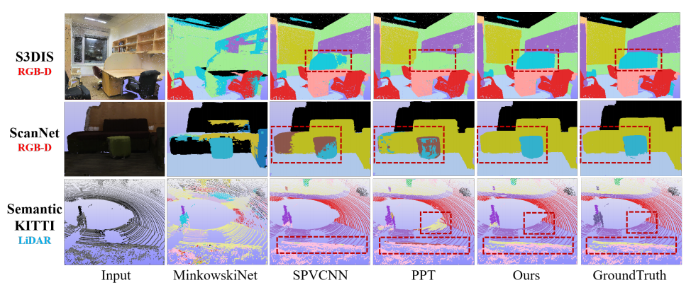

<h1 align="center">GeoAuxNet: Towards Universal 3D Representation Learning for Multi-sensor Point Clouds</h1>

<div align='center'>
Shengjun Zhang, Xin Fei, <a href='https://duanyueqi.github.io/'>Yueqi Duan</a>
</div>
<div align='center'>
Department of Electronic Engineering, Tsinghua University
</div>
<div align='center'>
Department of Automation, Tsinghua University
</div>

<div align='center'>
<a href="https://arxiv.org/pdf/2403.19220.pdf">View CVPR 2024 Paper Here</a>
</div>

<div id='result image' style='margin-top: 10px'>

<p align='center'>Semantic segmentation results on S3DIS and ScanNet from RGB-D cameras and SemanticKITTI from LiDAR. For
all methods, we trained collectively on three datasets. Our method outperforms other methods with better detailed structures.</p>
</div>

<div style="width: 100%; text-align: center;" align='center'>
    <table style="margin: 0 auto;">
        <thead>
            <tr>
                <th style="text-align: center;">Model</th>
                <th style="text-align: center;">Params</th>
                <th style="text-align: center;">S3DIS mIoU</th>
                <th style="text-align: center;">ScanNet mIoU</th>
                <th style="text-align: center;">SemanticKITTI mIoU</th>
            </tr>
        </thead>
        <tbody>
            <tr>
                <td style="text-align: center;">GeoAuxNet (joint)</td>
                <td style="text-align: center;">64.7M</td>
                <td style="text-align: center;">69.5</td>
                <td style="text-align: center;">71.3</td>
                <td style="text-align: center;">63.8</td>
            </tr>
        </tbody>
    </table>
</div>


## Overview
- [Installation](#installation)
- [Data Preparation](#data-preparation)
- [Quick Start](#quick-start)

## Installation

### Requirements
- Ubuntu: 18.04 or higher
- CUDA: 11.3 or higher
- PyTorch: 1.10.0 or higher

### Conda Environment
- Tested on Ubuntu 20.04.1, CUDA 11.6, pytorch==1.13.1
- See requirement.yaml for tested environment

```bash
conda create -n geo-aux python=3.8 -y
conda activate geo-aux
conda install ninja -y
# Choose version you want here: https://pytorch.org/get-started/previous-versions/
conda install pytorch==1.13.1 torchvision==0.14.1 torchaudio==0.13.1 pytorch-cuda=11.7 -c pytorch -c nvidia
conda install h5py pyyaml -c anaconda -y
conda install sharedarray tensorboard tensorboardx yapf addict einops scipy plyfile termcolor timm -c conda-forge -y
conda install pytorch-cluster pytorch-scatter pytorch-sparse -c pyg -y
pip install torch-geometric
pip install faiss-gpu

# spconv (SparseUNet)
# refer GitHub - traveller59/spconv: Spatial Sparse Convolution Library
pip install spconv-cu117

# PTv1 & PTv2 or precise eval
cd libs/pointops
python setup.py install

# docker & multi GPU arch
TORCH_CUDA_ARCH_LIST="ARCH LIST" python  setup.py install
# e.g. 7.5: RTX 3000; 8.0: a100 More available in: https://developer.nvidia.com/cuda-gpus
TORCH_CUDA_ARCH_LIST="7.5 8.0" python  setup.py install
cd ../..

# Open3D (visualization, optional)
pip install open3d
```

## Data Preparation

### S3DIS
- Run preprocessing code for S3DIS as follows:

```bash
# S3DIS_DIR: the directory of downloaded Stanford3dDataset_v1.2 dataset.
# RAW_S3DIS_DIR: the directory of Stanford2d3dDataset_noXYZ dataset. (optional, for parsing normal)
# PROCESSED_S3DIS_DIR: the directory of processed S3DIS dataset (output dir).

# S3DIS without aligned angle
python pointcept/datasets/preprocessing/s3dis/preprocess_s3dis.py --dataset_root ${S3DIS_DIR} --output_root ${PROCESSED_S3DIS_DIR}
```
- The processed s3dis dir should be organized as follow
```bash
s3dis
│── Area_1
    │── conferenceRoom_1.pth
    │── conferenceRoom_2.pth
    ...
│── Area_2
...
│── Area_6
```

### ScanNet

The preprocessing support semantic and instance segmentation for both `ScanNet20`, `ScanNet200` and `ScanNet Data Efficient`.

- Download the [ScanNet](http://www.scan-net.org/) v2 dataset.
- Run preprocessing code for raw ScanNet as follows:

```bash
# RAW_SCANNET_DIR: the directory of downloaded ScanNet v2 raw dataset.
# PROCESSED_SCANNET_DIR: the directory of processed ScanNet dataset (output dir).
python pointcept/datasets/preprocessing/scannet/preprocess_scannet.py --dataset_root ${RAW_SCANNET_DIR} --output_root ${PROCESSED_SCANNET_DIR}
```

- The processed scannet dir should be organized as follow
```bash
scannet
│── train
    │── scene0000_00.pth
    │── scene0000_01.pth
    ...
│── val
    ...
│── test
    ...
```


### SemanticKITTI
- Download [SemanticKITTI](http://www.semantic-kitti.org/dataset.html#download) dataset.
- Link dataset to codebase.
- The processed semanticKITTI dir should be organized as follow
- 
```bash
|- semantic_kitti
  |- dataset
    |- sequences
      |- 00
      |- 01
      |- ...
  |- poses
    |- 00.txt
    ...
```

### nuScenes
- Download the official [NuScene](https://www.nuscenes.org/nuscenes#download) dataset (with Lidar Segmentation) and organize the downloaded files as follows:
```bash
NUSCENES_DIR
│── samples
│── sweeps
│── lidarseg
...
│── v1.0-trainval 
│── v1.0-test
```
- Run information preprocessing code (modified from OpenPCDet) for nuScenes as follows:
```bash
# NUSCENES_DIR: the directory of downloaded nuScenes dataset.
# PROCESSED_NUSCENES_DIR: the directory of processed nuScenes dataset (output dir).
# MAX_SWEEPS: Max number of sweeps. Default: 10.
pip install nuscenes-devkit pyquaternion
python pointcept/datasets/preprocessing/nuscenes/preprocess_nuscenes_info.py --dataset_root ${NUSCENES_DIR} --output_root ${PROCESSED_NUSCENES_DIR} --max_sweeps ${MAX_SWEEPS} --with_camera

python pointcept/datasets/preprocessing/nuscenes/preprocess_nuscenes_info.py --dataset_root data/nuscenes --output_root data/preprocess_nuscenes --max_sweeps 10 --with_camera
```
- Link raw dataset to processed NuScene dataset folder:
```bash
# NUSCENES_DIR: the directory of downloaded nuScenes dataset.
# PROCESSED_NUSCENES_DIR: the directory of processed nuScenes dataset (output dir).
ln -s ${NUSCENES_DIR} {PROCESSED_NUSCENES_DIR}/raw
```
then the processed nuscenes folder is organized as follows:
```bash
nuscene
|── raw
    │── samples
    │── sweeps
    │── lidarseg
    ...
    │── v1.0-trainval
    │── v1.0-test
|── info
```

## Quick Start
### Training
**Train from scratch.** The training processing is based on configs in `configs` folder. 
The training script will generate an experiment folder in `exp` folder and backup essential code in the experiment folder.
Training config, log, tensorboard and checkpoints will also be saved into the experiment folder during the training process.
```bash
export CUDA_VISIBLE_DEVICES=${CUDA_VISIBLE_DEVICES}
# Script (Recommended)
sh scripts/train.sh -p ${INTERPRETER_PATH} -g ${NUM_GPU} -d ${DATASET_NAME} -c ${CONFIG_NAME} -n ${EXP_NAME}
# Direct
export PYTHONPATH=./
python tools/train.py --config-file ${CONFIG_PATH} --num-gpus ${NUM_GPU} --options save_path=${SAVE_PATH}
```

For example:
```bash
# By script
export CUDA_VISIBLE_DEVICES=${CUDA_VISIBLE_DEVICES}
sh scripts/train.sh -p python -d s3dis -c semseg-geo-s3-sc-sk -n semseg-geo-s3-sc-sk -g 4
# Direct
export PYTHONPATH=./
python tools/train.py --config-file configs/s3dis/semseg-geo-s3-sc-sk.py --num-gpus 4 --options save_path=exp/s3dis/semseg-geo-s3-sc-sk resume=True
```

**Resume training from checkpoint.** If the training process is interrupted by accident, the following script can resume training from a given checkpoint.
```bash
# Script (Recommended)
# simply add "-r true"
sh scripts/train.sh -p ${INTERPRETER_PATH} -g ${NUM_GPU} -d ${DATASET_NAME} -c ${CONFIG_NAME} -n ${EXP_NAME} -r true
# Direct
export PYTHONPATH=./
python tools/train.py --config-file ${CONFIG_PATH} --num-gpus ${NUM_GPU} --options save_path=${SAVE_PATH} resume=True weight=${CHECKPOINT_PATH}
```

### Testing

```bash
# By script (Based on experiment folder created by training script)
sh scripts/test.sh -p ${INTERPRETER_PATH} -g ${NUM_GPU} -d ${DATASET_NAME} -n ${EXP_NAME} -w ${CHECKPOINT_NAME}
# Direct
export PYTHONPATH=./
python tools/test.py --config-file ${CONFIG_PATH} --num-gpus ${NUM_GPU} --options save_path=${SAVE_PATH} weight=${CHECKPOINT_PATH}
```
For example:
```bash
sh scripts/test.sh -p python -d s3dis -n semseg-geo-s3-sc-sk -w model_best -g 1
# Direct
export PYTHONPATH=./
python tools/test.py --config-file configs/s3dis/semseg-geo-s3-sc-sk.py --options save_path=exp/s3dis/semseg-geo-s3-sc-sk weight=exp/s3dis/semseg-geo-s3-sc-sk/model/model_best.pth --num-gpus 1
```
